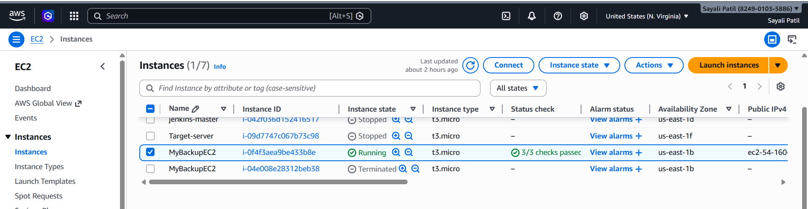
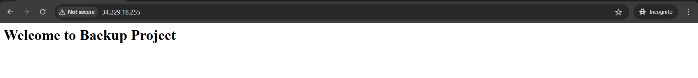
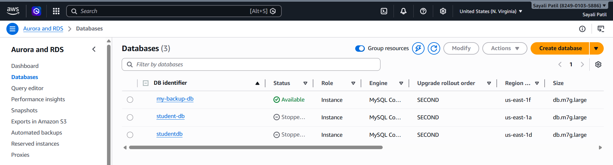
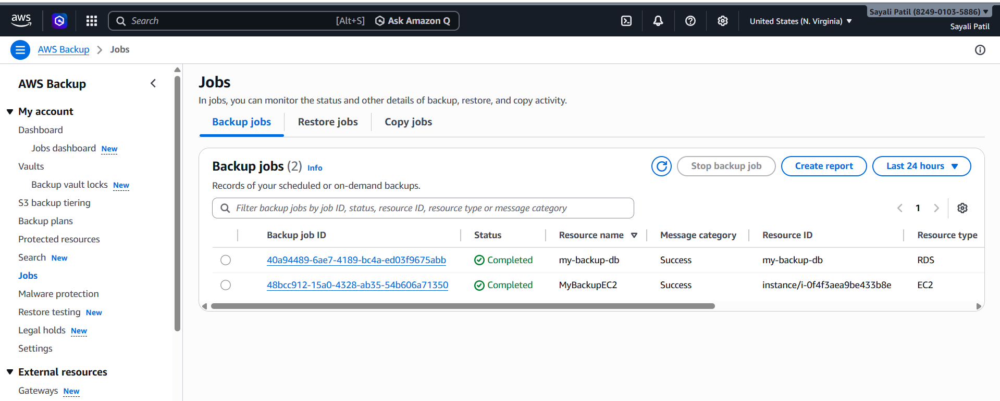

# Project: 2  Set Up AWS Backup Plan for EC2 and RDS 

The objective of this project is to learn how to configure and manage automated backup and recovery for cloud resources using AWS Backup. This includes launching an EC2 instance and an RDS database, and protecting them using a centralized backup plan.

## Architecture of Project

                +----------------------+
                |     AWS Backup       |
                |----------------------|
                |  Backup Plan         |
                |  (Daily, 35 Days)    |
                +----------+-----------+
                           |
        -----------------------------------------
        |                                       |
    +-------------------+               +-------------------+
    |   EC2 Instance    |               |    RDS Database   |
    | (Web Server Data) |               |      (MySQL)      |
    +-------------------+               +-------------------+
               |                                     |
               -------------- Backup -----------------
                                |
                      +------------------+
                      |  Backup Vault    |
                      | MyBackupVault    |
                      +------------------+
                                |
                      +------------------+
                      | Recovery Points  |
                      | (EC2 + RDS)      |
                      +------------------+

## AWS Services used for Project

* EC2 Instance (Amazon Linux)
* RDS Database (MySQL)
* AWS Backup (Vault + Backup Plan)
* AWS IAM (Manages permissions and roles for backup operations)

## Project Deployment

### 1. Infrastructure Setup

✅ EC2 Instance

* Launched an EC2 instance(MyBackupEC2) using Amazon Linux 
* Installed Apache web server
* Created a sample HTML file for testing

        Commands used:

      sudo yum update -y
      sudo yum install httpd -y
      sudo systemctl start httpd
      sudo systemctl enable httpd
      echo "Welcome to Backup Project" | sudo tee /var/www/html/index.html

✅ RDS Instance

* Created an RDS instance using MySQL
* Created a database and table
* Inserted sample data

### 2. AWS Backup Setup 

✅ Backup Vault

Created a backup vault named: MyBackupVault

✅ Backup Plan

* Plan Name: EC2-RDS-Backup-Plan

* Backup Rule: DailyBackup

* Frequency: Daily

* Retention Period: 35 days

* Lifecycle: Default 

✅ Resource Assignment

Assigned resources using Resource ID

Included:

* EC2 Instance

* RDS Database

* IAM Role used: AWSBackupDefaultServiceRole

### 4. Backup Job Validation

* Verified backup jobs in AWS Backup console

* Status confirmed as Completed

### 5. Recovery Points Verification

Checked backup vault for recovery points

Verified:
* EC2 backup available
* RDS backup available

## ⚠️ Issues Faced & Solutions

* Backup jobs not visible → Used on-demand backup
* Protected resources not showing → Assigned EC2 & RDS correctly
* Backup vault not found → Created and selected new vault
* RDS not visible → Checked region and status
* Recovery points not showing → Waited for job completion

### 🏁 Conclusion

This project successfully demonstrates how to implement a centralized backup solution using AWS Backup. Both EC2 and RDS resources were protected, and backups were verified using backup jobs and recovery points.

 ## 👤 About the Author

Hi, I'm **Sayali Patil** — a passionate Cloud & DevOps Learner ☁️  

📧 Email: rajputsayali1104@gmail.com  
🔗 LinkedIn: [linkedin.com/in/Sayali-Patil-599464362](https://linkedin.com/in/sayali-patil-599464362)  
🐱‍💻 GitHub: [github.com/iamsayalipatil](https://github.com/iamsayalipatil)  
✍️ Medium: [medium.com/@SayaliPatil1104](https://medium.com/@SayaliPatil1104)  

